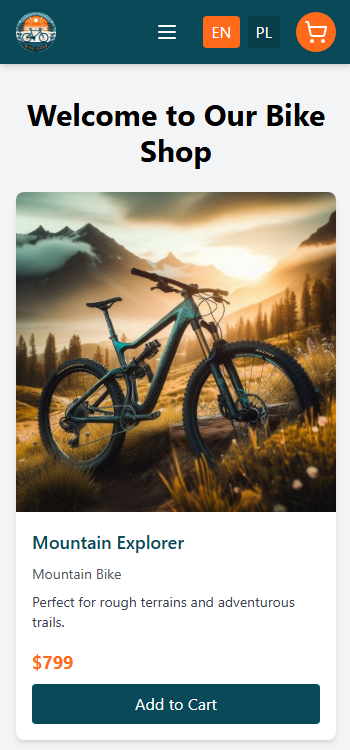
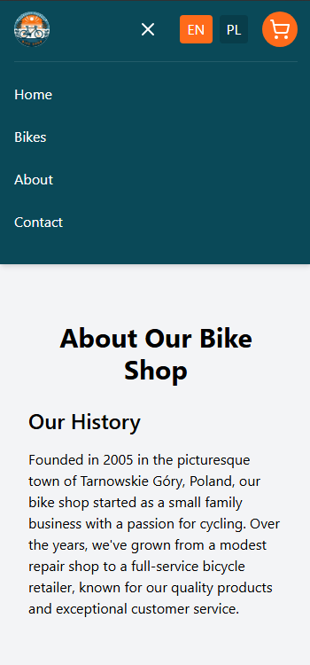

# Bike Shop Application

A simple bike shop website built with React and Vite. This application allows users to browse various types of bikes, view detailed information about each bike, and add bikes to their shopping cart.

## Features

- **Product Listings**: Displays a variety of bikes with images, descriptions, and prices.
- **Dynamic Language Switching**: The app supports multiple languages (for now English and Polish), with bike descriptions and types changing based on the selected language.
- **Shopping Cart**: Users can add bikes to their cart and proceed with the purchase (or just keep track of selected items).
- **Responsive Design**: The app is fully responsive and optimized for both desktop and mobile devices.
- **About Page**: Includes information about the store's history and location.

## Tech Stack

- **Frontend**: React (using functional components)
- **Build Tool**: Vite
- **State Management**: Context API (for Cart management)
- **Internationalization**: `react-i18next` for multi-language support
- **Styling**: TailwindCSS

## Screenshots

## Contact
If you'd like to get in touch, please write to: [rafal.wizen@gmail.com](mailto:rafal.wizen@gmail.com)

## License
This project is licensed under the MIT License.
