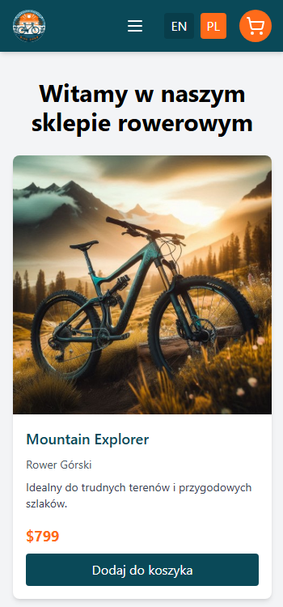
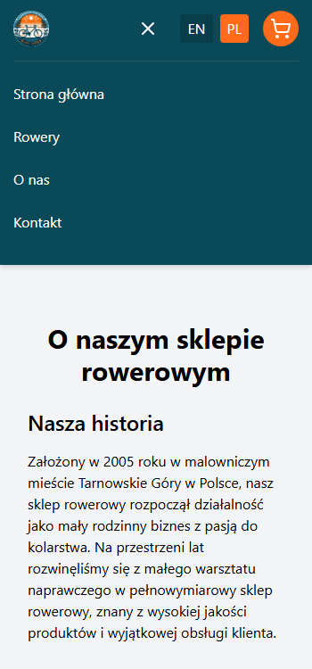

# Aplikacja Sklepu Rowerowego

Prosta strona internetowa sklepu rowerowego stworzona z użyciem React i Vite. Aplikacja pozwala użytkownikom przeglądać różne typy rowerów, zobaczyć szczegółowe informacje o każdym z nich i dodać rowery do koszyka.

## Funkcje

- **Lista produktów**: Wyświetla rowery z obrazkami, opisami i cenami.
- **Dynamiczna zmiana języka**: Aplikacja obsługuje wiele języków (na ten moment angielski i polski), z opisami rowerów i typami zmieniającymi się w zależności od wybranego języka.
- **Koszyk**: Użytkownicy mogą dodawać rowery do koszyka i przejść do zakupu (lub po prostu śledzić wybrane przedmioty).
- **Responsywny design**: Aplikacja jest w pełni responsywna i zoptymalizowana zarówno dla urządzeń stacjonarnych, jak i mobilnych.
- **Strona "O nas"**: Zawiera informacje o historii sklepu i jego lokalizacji.

## Technologie

- **Frontend**: React (z użyciem komponentów funkcyjnych)
- **Narzędzie do budowania**: Vite
- **Zarządzanie stanem**: Context API (do zarządzania koszykiem)
- **Tłumaczenia**: `react-i18next` do obsługi wielu języków
- **Stylowanie**: TailwindCSS

## Screeny ze strony

## Kontakt
Jeśli chcesz się skontaktować, napisz na: [rafal.wizen@gmail.com](mailto:rafal.wizen@gmail.com)

## Licencja
Projekt jest licencjonowany na podstawie licencji MIT.
